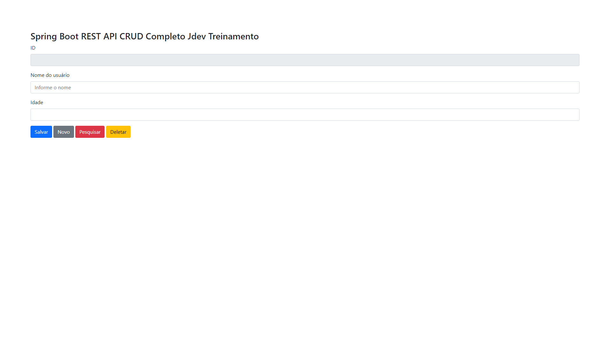

***

<div align="center">

[](https://git.io/typing-svg)


<a href="https://git.io/typing-svg" align="center"></a>  

***
#  Venho aqui apresentar  


  # Curso JDev Treinamentos

## Lançado curso CRUD Completo com Spring Boot REST API !!!

 ### Requisitos necessários:

🎯 Banco de Dados  ```postgreSql``` 

🎯 Front-End  ```JavaScript``` 

🎯 Back-End  ```Java```

🎯 IDE  ```Eclipse```

🎯 APIs  ```Postman``` & ```Ajax```.

# <div align="center">
#  
### [Clique aqui para acessar o Projeto](https://raizertechdev-production-7532.up.railway.app/springboot-rest-api-sample/)
  
   
  
***
  
  

***
<div align="left">
  
# Passo a Passo do Projeto (Back-End):
### Este projeto usa:
- `Maven` como ferramenta de construção;
- `Java` na versão 1.8;
- `Tomcat` na versão 10.0;
- `PostgreSql` na versão 9.5.

---
### Executando o aplicativo:
#### Na IDE `Eclipse`vai rodar  Na porta => `http://localhost:8081/`
---
### Building for Production:
#### Este aplicativo usa `JAR` como tipo de embalagem. Isso significa que você pode executar o seguinte comando no terminal para criar algo pronto para ser usado na produção.

```bash
mvn clean package
```
---
### Execução do Projeto  Spring com o  comando java -jar ::
- Vai no caminho da pasta que foi criada e dentro vai copiar a pasta `target`, então no comando do terminal cola o `caminho` da pasta,
- logo após dentro da pasta `target` vai copiar o arquivo em `jar` e cola no comando do terminal da seguinte forma:

```bash
$ java -jar springboot-rest-api-sample-1.0.0-SNAPSHOT.jar  
```

### No Postman para execução dos testes (APIs):
####  Vai executar na porta => http://localhost:8081/`springboot-rest-api-sample+nomedasAPIs`

***
# Passo a Passo do Projeto (Front-End): 

### Este projeto usa:
- `[Bootstrap CSS]` (https://getbootstrap.com/docs/4.0/components/forms/) para o formulário de pesquisa;
- `[JQuery]` (https://code.jquery.com/jquery-3.6.0.min.js) como framework;
- `Ajax`para consumo das APIs.

### Executando projeto no `servidor localhost` em Front-End:

####  Vai no navegador e digita: http://localhost:8081/springboot-rest-api-sample

### Executando projeto com `Deploy`:

####  https://rafarz76dev-production.up.railway.app/springboot-rest-api-sample/

---
# Implantação de serviço deploy:
- `Railway.app`

#### Criando um banco de dados `PostgreSQL`,copiando as variáveis ​​de ambiente do banco, criou- se o projeto do `git repositório` com base nessas variáveis, assim colando no editor RAW:

```properties
spring_profiles_active=prod
PROD_DB_HOST=containers-us-west-80.railway.app
PROD_DB_PORT=5481
PROD_DB_NAME=railway
PROD_DB_PASSWORD=3jEUMjlnmqIi7b0xVHwR
PROD_DB_USERNAME=postgres
```

<br>
  
---
### Gostou, então já clica na 🌟
